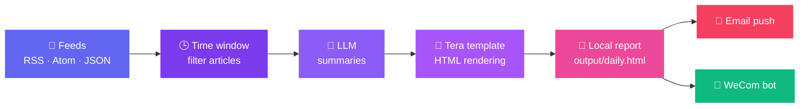

<div align="center">

<picture>
  <source media="(prefers-color-scheme: dark)" srcset="docs/logo.svg">
  
</picture>

# 📰 EverydayRSS

**Let AI read today's internet for you** · Fetch → Summarize → Report → Deliver, in a single command

[简体中文](README.md) · **English**

[](LICENSE)
[](Cargo.toml)
[](README.en.md#-scheduling)
[](README.en.md#-summary-language)
[](https://www.rust-lang.org/)


</div>

EverydayRSS fetches **RSS / Atom / JSON Feed** articles within a time window, generates summaries via an **OpenAI-compatible API**, and renders a polished **HTML daily report**. The summary language is configurable (Chinese by default). Run it once from the CLI, or register it as a system job — grab your morning coffee ☕ and the report is already in your inbox.



## ✨ Features

| | Feature | Details |
|---|---|---|
| 🔄 | **Multi-format feeds** | RSS, Atom and JSON Feed side by side |
| 🤖 | **AI summaries** | Works with any OpenAI-compatible endpoint, prompt included |
| 🌍 | **Summary language** | Chinese, English, Japanese… one config switch |
| 🎨 | **Template rendering** | Tera-based HTML templates — style your report however you like |
| ⏰ | **System scheduling** | macOS `launchd` / user-level Linux `systemd`, no daemon required |
| 📬 | **Multi-channel delivery** | SMTP email (full HTML body) + WeCom group bot |
| 🧙 | **Interactive wizard** | `everydayrss init` walks you through everything, zero manual setup |
| 🔐 | **Safer secrets** | Config files containing API keys are saved with `0600` permissions on Unix |

## 🚀 Quick Start

> [!NOTE]
> Requires **Rust 1.85+** (the project uses the Rust 2024 edition).

```bash
cargo install --path .
everydayrss init
```

If no default config exists when you run `everydayrss` for the first time, the setup wizard starts automatically. It configures **LLM → feed catalog → report path → date window → email/WeCom push**, and can register the scheduled task right away.

The default data directory is `~/.everydayrss`:

```text
~/.everydayrss/
├── config.toml                     # main config (API keys, 0600 permissions)
├── resources/feeds.example.toml    # feed catalog
├── templates/example.template.html # Tera template
├── output/daily.html               # generated report
└── logs/                           # runtime logs
```

Edit `resources/*.toml` to manage your subscriptions:

```toml
[[group]]
name = "Tech"

[[group.feed]]
name = "OpenAI"
url = "https://openai.com/news/rss.xml"
enabled = true
```

## 🛠️ Usage

| Command | What it does |
|---|---|
| `everydayrss run` | Fetch → summarize → render one report (and auto-push) |
| `everydayrss init` | Re-run the interactive setup wizard |
| `everydayrss push` | Push the most recently generated report |
| `everydayrss schedule install` | Register the system scheduled task |
| `everydayrss schedule status` | Show the registered task |
| `everydayrss schedule remove` | Remove the task |

<details open>
<summary><b>💡 Common examples</b> (click to collapse)</summary>

```bash
# Generate one report
everydayrss run

# Temporarily use another feed directory
everydayrss run --resource-dir ./my-feeds

# Use another config file
everydayrss --config ./config.toml run

# Override the window to the last 2 hours for this run only
everydayrss run --lookback-hours 2

# Push the most recent report
everydayrss push

# Push a specific report file
everydayrss push --file ./output/2026-09-24.html
```

</details>

### ⏰ Scheduling

```bash
# Run daily at 08:30
everydayrss schedule install --hour 8 --minute 30

# Or every 6 hours
everydayrss schedule install --every-hours 6

# Inspect or remove the system task
everydayrss schedule status
everydayrss schedule remove
```

macOS uses the current user's <kbd>launchd</kbd>; Linux uses user-level <kbd>systemd</kbd>. Install the binary to a stable path via `cargo install --path .` before registering the schedule.

> [!TIP]
> Linux user-level systemd only runs while you are logged in — triggers missed while logged out are caught up on the next start via `Persistent=true`. During installation, EverydayRSS tries to enable linger automatically (keeping your user manager alive in the background); if it lacks permission, run `sudo loginctl enable-linger <user>` once, and the timer will fire on time without any login.

## 🌍 Summary Language

The `Summary language` option in the setup wizard sets the summary language, defaulting to `Chinese`. You can also edit the config directly:

```toml
[llm]
summary_language = "Chinese"
```

Change it to `English`, `Japanese`, `Simplified Chinese`, and so on. The value is written into the LLM system prompt; JSON field names always stay in English, and original article titles and URLs are never translated.

## 📬 Report Delivery

Re-run `everydayrss init` to configure delivery interactively. Besides the automatic push during `everydayrss run`, you can push an existing report with `everydayrss push`: by default it sends the newest HTML file in the output directory, or any HTML file you point at with `--file`.

<details>
<summary><b>📧 Email (SMTP)</b> — sends the full HTML as the message body</summary>

```toml
[notifications.email]
enabled = true
smtp_host = "smtp.example.com"
smtp_port = 587
security = "starttls" # starttls / tls / none
username = "rss@example.com"
password = "SMTP_PASSWORD"
from = "rss@example.com"
to = ["you@example.com"]
subject = "EverydayRSS Daily"
```

</details>

<details>
<summary><b>💬 WeCom</b> — custom bot webhook for internal group chats</summary>

```toml
[notifications.wecom]
enabled = true
webhook_url = "https://qyapi.weixin.qq.com/cgi-bin/webhook/send?key=YOUR_KEY"
```

</details>

> [!IMPORTANT]
> A failed push never deletes the locally generated report — the command returns an error along with the report path. The "WeChat bot" here refers to a **WeCom (Enterprise WeChat) internal group** bot, not a personal WeChat bot.

## 🧠 How the Date Window Works

When `lookback_hours` is not configured, the window automatically follows the registered schedule's period: 24 hours for a daily task, or the matching N hours for interval tasks. You can set `lookback_hours` in the config for a fixed override, or use `run --lookback-hours N` to override a single run. If no task is registered and no custom value exists, it falls back to 24 hours.

The program prefers an article's `published` time and falls back to `updated`; articles dated more than five minutes in the future are ignored so that misdated entries never pollute the report.

Some feeds provide no article dates at all. `include_undated = true` (the default) keeps those articles; set it to `false` to strictly process only dated content.

All relative paths are resolved against the directory containing `config.toml`, so scheduled runs and manual runs always agree.

## 🧪 Development

```bash
cargo test --all-targets
cargo clippy --all-targets -- -D warnings
```

<div align="center">


**EverydayRSS** · Open-sourced under [MIT](LICENSE) · Built with 🦀 Rust

</div>
