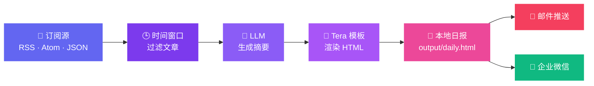

<div align="center">

<picture>
  <source media="(prefers-color-scheme: dark)" srcset="docs/logo.svg">
  
</picture>

# 📰 EverydayRSS

**让 AI 帮你读完今天的互联网** · 抓取 → 摘要 → 日报 → 推送,一条命令搞定

**简体中文** · [English](README.en.md)

[](LICENSE)
[](Cargo.toml)
[](README.md#-计划任务)
[](README.md#-摘要语言)
[](https://www.rust-lang.org/)


</div>

EverydayRSS 会抓取指定时间窗口内的 **RSS / Atom / JSON Feed** 文章,调用 **OpenAI 兼容接口**生成摘要,并渲染一份 **HTML 日报**。摘要语言可配置,默认使用中文。它既可作为命令行工具单次运行,也可注册为系统每日任务,清晨一杯咖啡 ☕,日报已经躺进邮箱。



## ✨ 特性

| | 特性 | 说明 |
|---|---|---|
| 🔄 | **多源格式** | 同时支持 RSS、Atom 与 JSON Feed |
| 🤖 | **AI 摘要** | 任意 OpenAI 兼容接口,system prompt 开箱即用 |
| 🌍 | **摘要语言** | 中文、英文、日文……一个配置项切换 |
| 🎨 | **模板渲染** | 基于 Tera 的 HTML 模板,日报样式随心定制 |
| ⏰ | **系统级调度** | macOS `launchd` / Linux 用户级 `systemd`,无需常驻进程 |
| 📬 | **多渠道推送** | SMTP 邮件(完整 HTML 正文)+ 企业微信机器人 |
| 🧙 | **交互式向导** | `everydayrss init` 一步步引导,零手工配置也能上手 |
| 🔐 | **权限安全** | 含密钥的配置文件在 Unix 上以 `0600` 权限保存 |

## 🚀 快速开始

> [!NOTE]
> 需要 **Rust 1.88+**(项目使用 Rust 2024 edition,依赖项的当前 MSRV 为 1.88)。

```bash
cargo install --path .
everydayrss init
```

### 🐳 GHCR 容器

镜像同时支持 `linux/amd64` 与 `linux/arm64`。先创建持久化卷并运行交互式初始化:

> [!NOTE]
> GHCR 包首次发布时默认为私有。公开使用前可在 GitHub Package 设置中改为 **Public**;保持私有时,请先使用具备 `read:packages` 权限的 Token 登录: `echo "$GHCR_TOKEN" | docker login ghcr.io -u YOUR_GITHUB_USER --password-stdin`。

```bash
docker volume create everydayrss-data

docker run --rm -it \
  -v everydayrss-data:/data \
  ghcr.io/userb1ank/everydayrss:latest init
```

初始化时配置每日或间隔计划。随后以后台容器启动内置调度器,并通过 `TZ` 指定每日任务使用的时区:

```bash
docker run -d \
  --name everydayrss \
  --restart unless-stopped \
  -e TZ=Asia/Shanghai \
  -v everydayrss-data:/data \
  ghcr.io/userb1ank/everydayrss:latest

docker logs -f everydayrss
```

镜像默认执行 `everydayrss daemon`:到达计划时间时自动生成报告并推送,单次任务失败不会导致容器退出。配置、订阅源、模板和输出报告都保存在 `everydayrss-data` 卷中。

手动立即生成一次日报或执行其他子命令:

```bash
docker run --rm \
  -v everydayrss-data:/data \
  ghcr.io/userb1ank/everydayrss:latest run

docker run --rm \
  -v everydayrss-data:/data \
  ghcr.io/userb1ank/everydayrss:latest schedule status
```

容器中的 `schedule install` 只更新内置调度配置,不会调用 systemd。修改计划后重启容器即可立即按新周期重新计算下一次触发时间。也可以使用 `daemon --run-on-start` 在容器启动时先执行一次。

首次直接运行 `everydayrss` 时,如果默认配置不存在,也会自动进入初始化向导。向导会依次配置 **LLM → 订阅目录 → 报告路径 → 日期窗口 → 邮件/企业微信推送**,并可选择立即注册计划任务。

默认数据目录是 `~/.everydayrss`:

```text
~/.everydayrss/
├── config.toml                     # 主配置(含 API Key,0600 权限)
├── resources/feeds.example.toml    # 订阅源目录
├── templates/example.template.html # Tera 模板
├── output/daily.html               # 生成的日报
└── logs/                           # 运行日志
```

编辑 `resources/*.toml` 即可维护订阅源:

```toml
[[group]]
name = "技术"

[[group.feed]]
name = "OpenAI"
url = "https://openai.com/news/rss.xml"
enabled = true
```

## 🛠️ 使用

| 命令 | 作用 |
|---|---|
| `everydayrss run` | 抓取 → 摘要 → 渲染一份日报(并自动推送) |
| `everydayrss daemon` | 常驻运行并按配置的计划生成、推送日报 |
| `everydayrss init` | 重新进入交互式配置向导 |
| `everydayrss push` | 单独推送最近生成的一份报告 |
| `everydayrss schedule install` | 注册系统计划任务 |
| `everydayrss schedule status` | 查看已注册的计划任务 |
| `everydayrss schedule remove` | 移除计划任务 |

<details open>
<summary><b>💡 常用示例</b>(点击折叠)</summary>

```bash
# 生成一次日报
everydayrss run

# 临时使用另一个订阅目录
everydayrss run --resource-dir ./my-feeds

# 使用另一个配置文件
everydayrss --config ./config.toml run

# 本次运行临时改为只取最近 2 小时
everydayrss run --lookback-hours 2

# 推送最近生成的一份报告
everydayrss push

# 推送指定的报告文件
everydayrss push --file ./output/2026-09-24.html
```

</details>

### ⏰ 计划任务

```bash
# 每天 08:30 运行
everydayrss schedule install --hour 8 --minute 30

# 或每 6 小时运行
everydayrss schedule install --every-hours 6

# 查看或移除系统任务
everydayrss schedule status
everydayrss schedule remove
```

macOS 使用当前用户的 <kbd>launchd</kbd>,Linux 使用用户级 <kbd>systemd</kbd>。建议先通过 `cargo install --path .` 安装稳定路径下的二进制,再注册计划任务。

> [!TIP]
> Linux 的用户级 systemd 只在登录期间运行:错过的触发点会由 `Persistent=true` 在下次启动时补跑。安装时 EverydayRSS 会尝试自动开启 linger(让用户实例常驻后台);若权限不足,手动执行 `sudo loginctl enable-linger <用户名>`,之后无需登录也能准点执行。

## 🌍 摘要语言

初始化向导中的 `Summary language` 可以设置摘要语言,默认值为 `Chinese`。也可以直接编辑配置:

```toml
[llm]
summary_language = "Chinese"
```

可改为 `English`、`Japanese`、`Simplified Chinese` 等语言名称。该值会写入 LLM 的 system prompt;JSON 字段名始终保持英文,原始文章标题和 URL 不会翻译。

## 📬 报告推送

重新运行 `everydayrss init` 可以交互式配置推送。除了在 `everydayrss run` 时自动推送,也可以用 `everydayrss push` 单独推送已生成的报告:默认推送输出目录中最新的 HTML 文件,或用 `--file` 指定任意 HTML 文件。

<details>
<summary><b>📧 邮件(SMTP)</b> — 完整 HTML 作为邮件正文</summary>

```toml
[notifications.email]
enabled = true
smtp_host = "smtp.example.com"
smtp_port = 587
security = "starttls" # starttls / tls / none
username = "rss@example.com"
password = "SMTP_PASSWORD"
from = "rss@example.com"
to = ["you@example.com"]
subject = "EverydayRSS 日报"
```

</details>

<details>
<summary><b>💬 企业微信</b> — 内部群自定义机器人 Webhook</summary>

```toml
[notifications.wecom]
enabled = true
webhook_url = "https://qyapi.weixin.qq.com/cgi-bin/webhook/send?key=YOUR_KEY"
```

</details>

> [!IMPORTANT]
> 推送失败不会删除已经生成的本地报告,命令会返回错误并给出报告路径。这里的「微信机器人」指**企业微信内部群**机器人,不是个人微信机器人。

## 🧠 日期窗口如何确定

默认不配置 `lookback_hours` 时,日期窗口会自动采用已注册计划任务的周期:每日任务是 24 小时,间隔任务则使用对应的 N 小时。可以在配置中设置 `lookback_hours` 固定覆盖,也可以用 `run --lookback-hours N` 仅覆盖本次运行。尚未注册计划任务且没有自定义值时回退为 24 小时。

程序优先使用文章的 `published` 时间,没有时使用 `updated`;超过当前时间五分钟以上的未来文章会被忽略,以避免错误日期污染日报。

部分订阅源完全不提供文章日期。`include_undated = true`(默认)会保留这些文章;设为 `false` 可严格只处理带日期的内容。

所有相对路径都以 `config.toml` 所在目录为基准,因此计划任务与手动运行会得到一致结果。

## 🧪 开发

```bash
cargo test --all-targets
cargo clippy --all-targets -- -D warnings
```

<div align="center">


**EverydayRSS** · 以 [MIT](LICENSE) 许可证开源 · 用 🦀 Rust 构建

</div>
